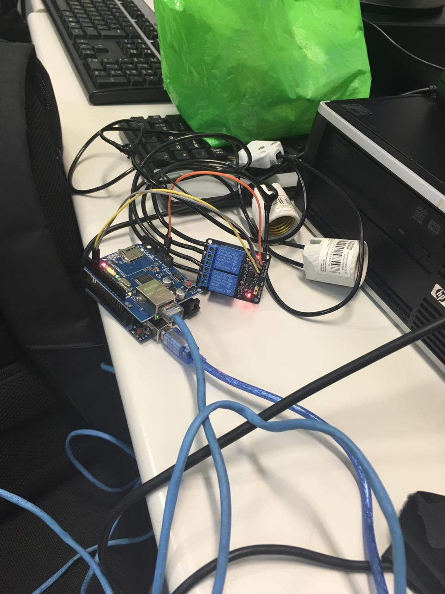
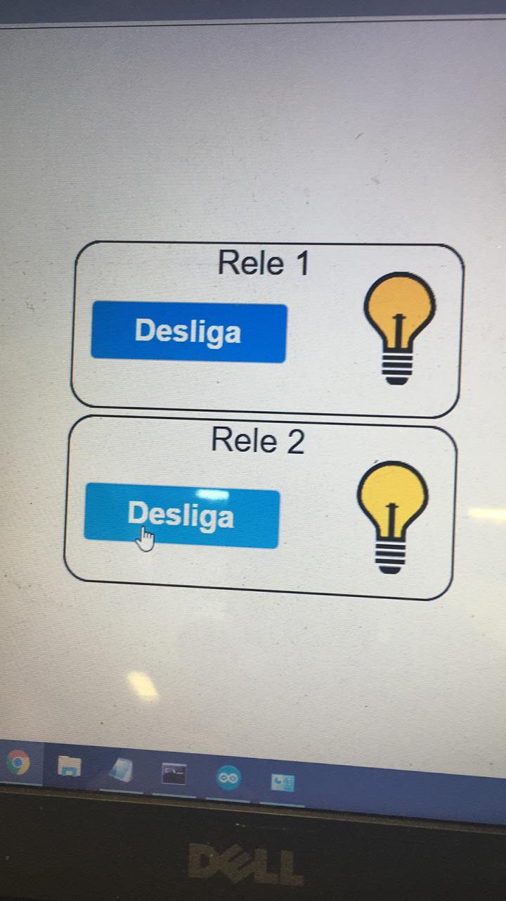

# Documento de Visão do Projeto "Acendimento de Lâmpadas via internet com arduino"

Este documento apresenta uma solução de software para o projeto *"Acendimento de Lâmpadas via internet com arduino"*, 
apresentando os problemas a serem solucionados, as necessidades dos principais envolvidos, o alcance do projeto e as funcionalidades esperadas.

## Objetivos

* Objetivo 1: Automatizar acendimento de lâmpadas;
* Objetivo 2: Facilitar o dia-a-dia nas casas, possibilitando o acendimento via internet;

## Problema

* Descrição do problema: Atualmente a maioria das casas têm o acendimento de lâmpadas padrão, por meio de interruptores.
* Quem é afetado pelo problema: Todas as pessoas que têm um imóvel com energia elétrica.
* Impacto no negócio: Caso seja efetivado, terá um grande impacto no mercado, pois é algo inovador e facilitador.
* Benefícios de uma boa solução: Grande facilidade no dia-a-dia, agilizando o processo de acendimento de lâmpadas.

## Integração com outros sistemas

* Celulares;
* Computadores;
* Dispositivos com acesso à internet;
 
## Interessados

* Pessoas físicas, com o fim de instalarem nas suas casas;
* Empresas, com o fim de instalarem em seus escritórios;
* Empresas, com o fim de revender o produto com sua marca;

## Usuários

* Pessoa com celular com acesso à internet;
* Pessoa com computador com acesso à internet;

## Funcionalidades do produto

* Acendimento de lâmpadas via internet.

## Restrições do projeto

* Necessaário acesso à internet;
* Necessário instalação e configuração do equipamento;
* Necessário energia elétrica.

## Protótipos

### Protótipos para funcionalidade 1

Protótipo do projeto

### Protótipos para funcionalidade 2

Interface do projeto online.

### Protótipos para funcionalidade N
