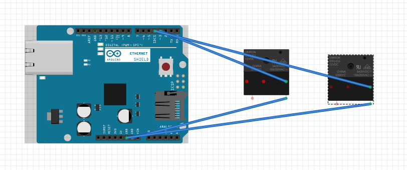

# Descriçao do Hardware

Descrição resumida do projeto
Como atualmente o mundo está em processo de automatização, neste projeto iremos fazer o procedimento de acender lâmpadas por meio da internet, utilizando as seguintes peças:

01 – Placa Uno R3 - Processa os dados (Entrada/Saída)

01 – Cabo USB - Conecta o Arduino ao computador

01 – Fonte DC Chaveada 9V 1A Plug P4 - Responsável por ligar o Arduino na tomada

01 – Ethernet Shield W5100 - Conecta o Arduino na Rede

01 – Cabo de Rede Conector RJ45 1,5m - Conecta o Arduino no modem

40 – Jumpers Macho-Fêmea - Onde a energia é transmitida para o relé

01 – Módulo Relé 5v 2 Canais - Responsável por ligar as lâmpadas 110V

01 – Fio Simples 1,0mm 3m - Responsável por conectar o soquete da lâmpada no relé

02 – Lâmpada E14 15W - Responsável pelo fornecimento de luz

02 – Soquete Lâmpada E14 - Responsável por conectar e fornecer energia à lâmpada

01 – Plug Tomada Macho - Responsável por conectar o projeto na tomada para ligá-lo

# Print Fritzing

